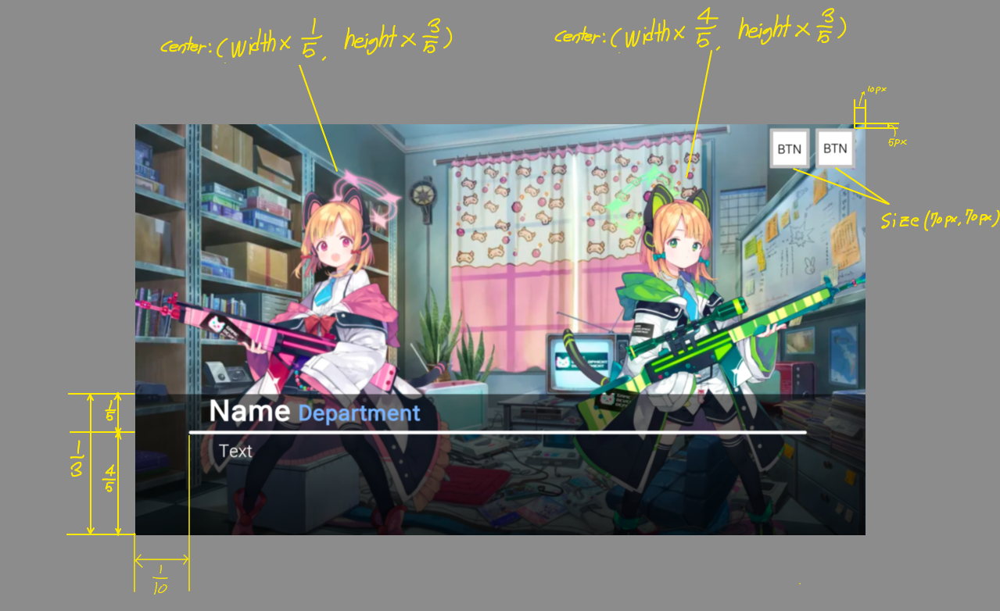

# Millennium Run

[한국어](#기획서-한국어)  
[English (translation)](#proposal-english)  

# 기획서 (한국어)
### 1. 스토리
밀레니엄 학원의 게임 개발부가 자신들이 만든 게임을 플레이해보고 감상을 들려달라는 부탁을 받은 샬레의 선생이 게임 개발부 부실에 방문한다. '사이바 모모이'가 밀레니엄 학원을 배경으로 게임을 만들었다고 자신만만하게 큰소리치며 선생이 게임을 시작하는 것으로 본 2차 창작 게임이 시작된다.

### 2. 장면 설정
<b>해당 내용은 제작 도중 변경될 수 있다.</b>
> Intro
1. 게임 개발부와 대화  
  
- `ESC`키 또는 `생략 버튼`으로 해당 장면을 건너뛸 수 있다.
- 폰트는 `NEXON Lv2 Gothic`을 사용한다.
- 배경은 화면 중심에 위치한다.
- 화면은 16:9 비율을 유지한다.
- 모든 대화가 끝나면 검은색 화면으로 페이드 아웃(Fade out)되고 [2. 안내문구]로 장면이 바뀐다.

2. 안내문구  
  
- 검은색 화면에서 페이드 인(Fade in)된다.
- 안내 문구는 화면 중앙에 위치한다.
- 폰트는 `NEXON Lv2 Gothic`을 사용한다.
- 화면은 16:9 비율을 유지한다.
- 화면 오른쪽 하단에 유료 라이센스 라이브러리의 로고를 넣는다.
- 일정 시간 이후 검은색 화면으로 페이드 아웃(Fade out)된다.

 

# Proposal (English Translation)
### 1. Story
Schale's teacher visits the Game Development Department at Millennium Science School. Because they asked to play the game they made and share the review. After talking with students from the Game Development Department Schale's teacher starts the game.

### 2. Scene Settings
<b>The contents may be changed during production.</b>
> Intro
1. Talking with Game Development Department  
  
- skip the scene with the 'ESC' key or the 'skip button'.
- Use `NEXON Lv2 Gothic` for the font.
- The background is located in the center of the screen.
- The screen maintains the 16:9 aspect ratio.
- When all conversations are over, it fades out to a black screen and the scene changes to [2. Informations].

2. Informations  

- Fade in on a black screen.
- The guide text is located in the center of the screen.
- Use `NEXON Lv2 Gothic` for the font.
- The screen maintains the 16:9 aspect ratio.
- Put the logo of the paid license library on the bottom right of the screen.
- Fade out to a black screen after a certain period of time.
